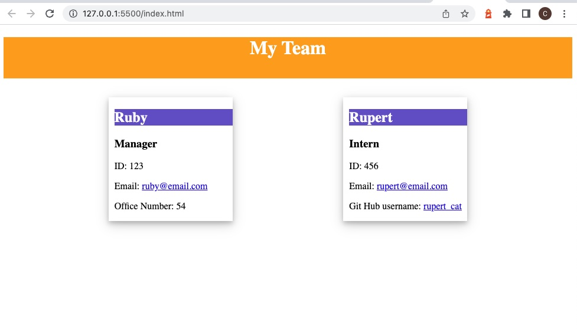
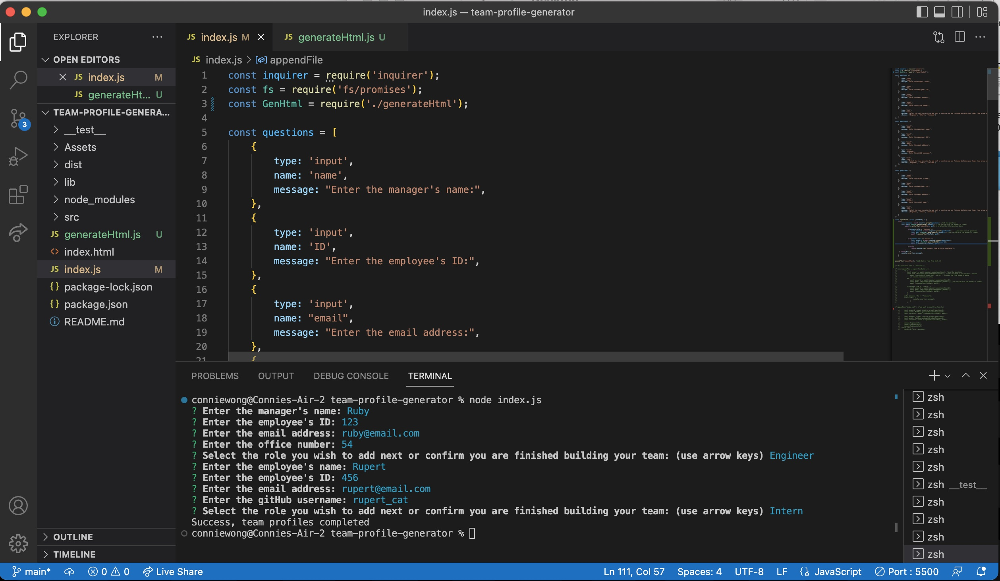

# Team Profile Generator

Link to video walkthrough site: [https://drive.google.com/file/d/18Q_PcBTJZq-6Vxu8yZPflHJxyJDosMe_/view](https://drive.google.com/file/d/18Q_PcBTJZq-6Vxu8yZPflHJxyJDosMe_/view)

## Description

This is a command-line appication that generates an HTML webpage using inquirer node.js. The purpose of the app is so users can input data to creaete a team profile webpage that displays a summary for each employee such as their name, role, id, email and information relevant to the role. Unit tests are also written using jest to ensure the codes pass and is maintainable.

## Installation

This app runs in the command-line terminal. It leverages the Inquirer package to prompt inputs from the user which then generates the HTML file. 

## Preview & Usage

1. Install any necessary dependencies, run the following command npm i
2. Initiate the app using the CLI/terminal and run command using node.js - node index.js
3. When you are prompt with questions, enter your inputs.
4. Once all questions are answered, it will generate an HTML file in the current folder.
Click [here](https://drive.google.com/file/d/1_QGo400kw9HCG4H6-4tv6qQLNixVww5b/view) to watch a video walk-through.

## License

There were no licenses obtained for this project. For more information on licenses, follow this link:
[https://choosealicense.com/](https://choosealicense.com/).